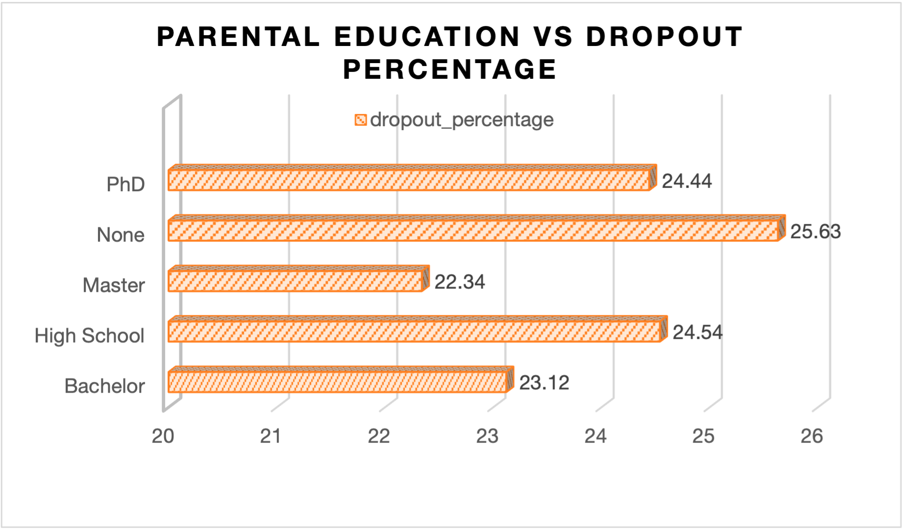
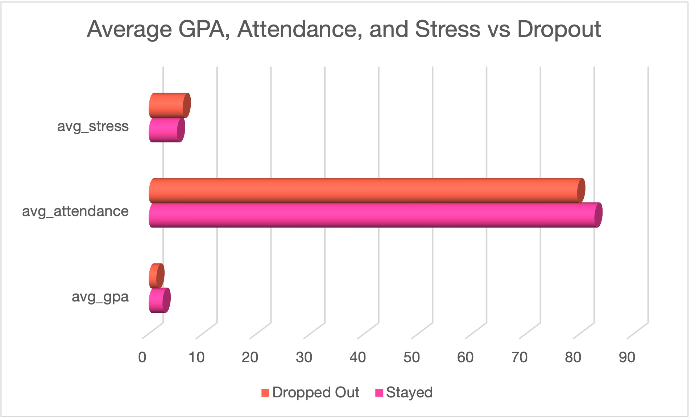
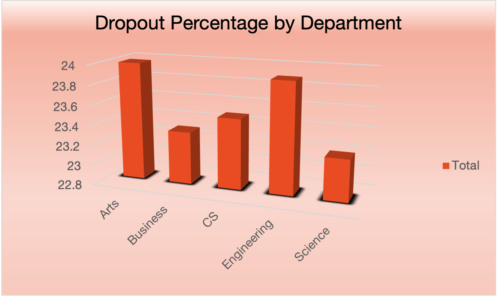
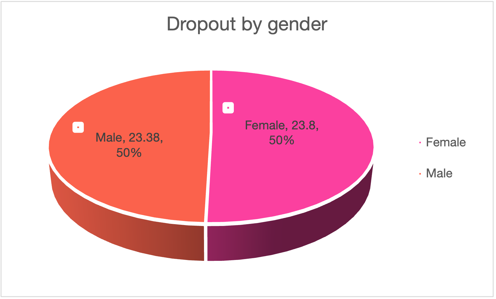

# Student-Dropout-Risk-Analysis-Using-SQL
## Project Overview 
This project analyzes student dropout patterns using SQL to identify key academic and demographic factors associated with increased dropout risk.
--- 
## Tools used 
- SQL 
- Excel 
- GitHub
- VS.Code
----
## Dataset
The dataset for this project comes from kaggle and contains contains 10,000 rows and 19 columns with student demographic, behavioral, and academic features along with the dropout target variable.

Source: https://www.kaggle.com/datasets/meharshanali/student-dropout-prediction-dataset

The dataset includes: 
- Student demographics
- Enviromental factors
- Educational paths/performance
- Dropout rate

The raw dataset is available here: [student_dropout_dataset_v3.csv](Data/raw/student_dropout_dataset_v3.csv).

--- 
## Data Cleaning 

Before analysis, the raw data required the following cleaning steps: 
- Removed duplicate rows
- Checked for null values
- Checked for validity and range of important

The cleaned dataset is available in the `Data/Processed` folder: [cleaned_dropoutdata.cvs.numbers](Data/Processed/cleaned_dropoutdata.cvs.numbers)

---
## Exploratory Data Analysis (SQL)
The SQl Quieries used to analyze the data are located in the [sql folder](sql/analysis_queries.sql).

Key analysis included: 
- Data Cleaning Validation Queries
- Exploratory Analysis Queries
- Risk Segmentation Queries
- Insight Interpretation

---
## Visualizations

### Dropout Rate by GPA and Attendance

### Parental Education vs. Dropout 

### GPA, Attendance, Stress Index

### Dropout Percentage by Department 

### Dropout Percentage by Gender

## Key Insights

• Students with both low GPA and low attendance exhibit the highest dropout rates.

• Students in the Art department reported the highest dropout rate followed by Engineering.

• Students whose parents have earned a Phd. reported a high dropout rate than those with Master or a Bachelor's degree.

• Higher stress levels correlate with increased dropout likelihood.

## Limitations

• The dataset does not include financial information, which may influence dropout decisions.

• Stress levels are self-reported and may contain bias.

• The dataset represents a limited number of institutions.
